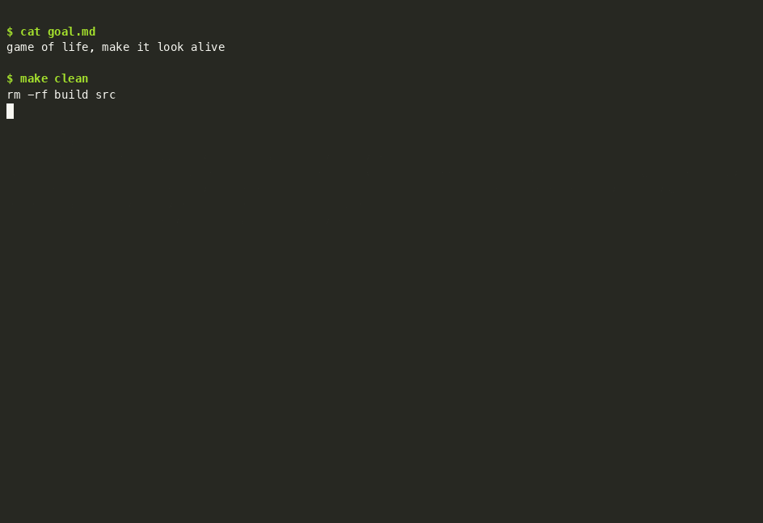
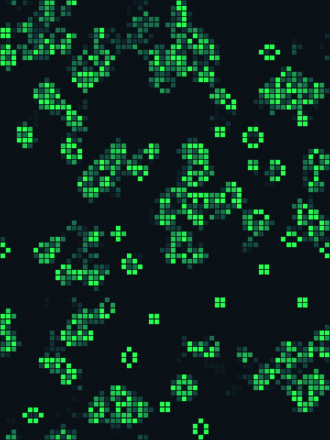
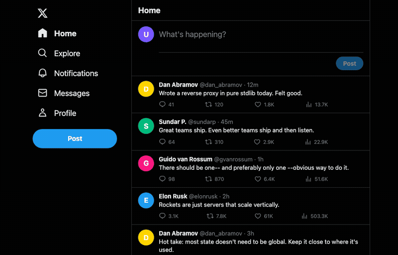
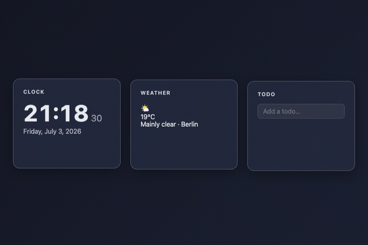
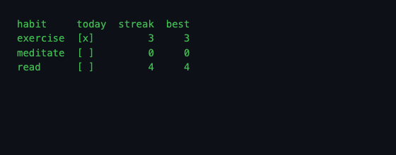
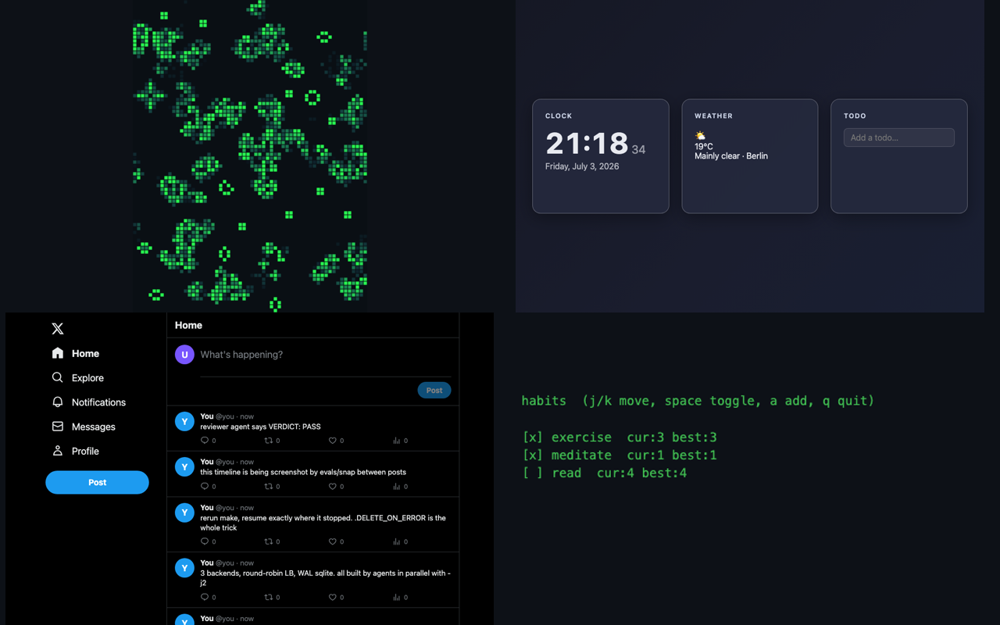

# agentmake

**`make` is the agent orchestrator you already have.** Write a goal, get a dep-ordered swarm of agents building it — parallel, resumable, gated.

## What / why

agentmake turns `make` into an agentic build engine:

- `goal.md` → planning agent decomposes into `plan.json`
- `jq` generates `components.mk` — the DAG comes from the agent, the scheduling from make
- one build agent per component, dep-ordered, parallel with `-j`
- every artifact gated: plan validity, per-component `check.sh`, reviewer `VERDICT: PASS`
- `.DELETE_ON_ERROR` = failed agent never counts as done; rerun `make` resumes exactly where it stopped
- `make progress` census, `make graph` mermaid, visual evals via lowres screenshots (`evals/snap` + `evals/evalshot`)

Your project Makefile is 3 lines:

```make
GOAL ?= goal.md
include engine/build.mk
```

## Docs

- [Engine internals](docs/engine-internals.md) — the make features doing the work (`.DELETE_ON_ERROR`, `-include` restart, sentinel targets, `-j` scheduling, resume) and why each earns its place
- [Evals](docs/evals.md) — snap / evalshot / apieval / TUI goldens / wfcheck / matrix: when each fires, and the golden update protocol
- [Effort & HITL](docs/effort-and-hitl.md) — the effort classifier tiers and the single human-in-the-loop switch (`approvals/<step>.ok`, `AUTOPILOT=1`)

## Quickstart

```
TODO: clone-and-run instructions (see backlog: viral packaging)
```

## Demos

| Demo | Goal | Result |
|------|------|--------|
| [game-of-life](demos/game-of-life/) | "game of life, make it look alive" (vague tier) | canvas GoL with age-fade trails, screenshot golden gate |
| [tui-habits](demos/tui-habits/) | terminal habit tracker (standard tier) | curses TUI, tmux capture-pane goldens |
| [desk-dashboard](demos/desk-dashboard/) | clock/weather/todo dashboard (vague tier) | live panels, 2 fix-forward loops |
| [twitter-x](demos/twitter-x/) | X clone PRD (prd tier) | 3 backends + round-robin LB + WAL sqlite, built `-j2` |
| [forth-forth](demos/forth-forth/) | Forth compiler in Forth (prd tier) | staged bootstrap, selfhost fixed point |

## Media

### The engine, live

Real unedited rebuild of `demos/game-of-life` — `make clean && make -j2`, agents plan,
build, check, review; then `make progress` + `make graph`. Idle time capped at 2s
(`asciinema rec -i 2`), so agent thinking pauses are compressed, nothing else is.
Cast file: [`media/engine-run.cast`](media/engine-run.cast).



### What it builds

| | |
|---|---|
| **game-of-life** — successive generations from the deterministic eval harness (`eval.html?t=40..51`, seeded PRNG) |  |
| **twitter-x** — live 3-backend stack behind the round-robin proxy; tweets POSTed via `curl` between screenshots |  |
| **desk-dashboard** — live page screenshots: clock ticking, real open-meteo fetch |  |
| **tui-habits** — real `tmux capture-pane` output, re-rendered for the gif |  |

### Gallery


