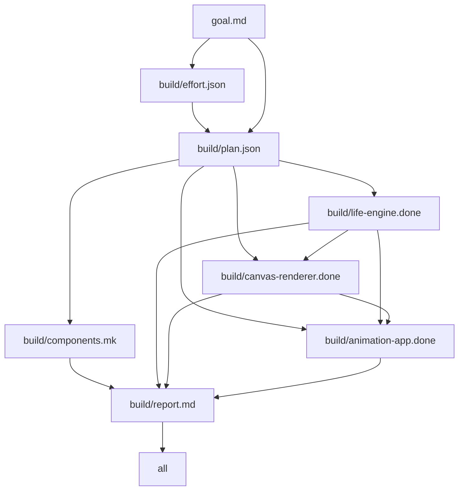

# agentmake

**Agents write the DAG. `make` runs the agents.**

You write a goal file. A planning agent decomposes it into components with
dependencies; `jq` turns that plan into makefile rules; GNU make schedules one
build agent per component — parallel with `-j`, resumable by default, and gated
at every step by mechanical checks. There is no orchestrator daemon and no
framework: the entire engine is [~80 lines of Makefile](engine/build.mk).


*Real, unedited rebuild of `demos/game-of-life` — `make clean && make -j2`:
classify → plan → three build agents → review gate, then `make progress` and
`make graph`. Idle time capped at 2s (`asciinema rec -i 2`), so agent thinking
pauses are compressed; nothing else is. Cast file:
[`media/engine-run.cast`](media/engine-run.cast).*

## 60-second quickstart

```sh
git clone <this repo> && cd agentmake
make demo        # needs the pi (or claude) CLI on PATH with an API key
```

`make demo` wipes and rebuilds [`demos/game-of-life`](demos/game-of-life/)
from its 33-byte goal — real agents, real gates, ends with the artifact census
and the dependency graph. Pick a bigger one with `make demo DEMO=twitter-x`.
No API key? The gif above *is* that run.

Your own project is a folder with two files:

```sh
mkdir my-thing && cd my-thing
echo "a pomodoro timer, keyboard only" > goal.md
printf 'GOAL ?= goal.md\ninclude ../agentmake/engine/build.mk\n' > Makefile
make -j4
```

## You get what you ask for

Phase 0 of every run classifies *your* effort. A one-liner gets a small, cheap
swarm and a smoke review; a full PRD gets a wide fan-out, a big model, and a
reviewer that checks every acceptance criterion. Same command either way —
the prompt is the budget dial. All five demos below were built by the engine
from the goal file shown, unedited:

| demo | the prompt | tier → plan | what came out | |
|---|---|---|---|---|
| [game-of-life](demos/game-of-life/) | ["game of life, make it look alive"](demos/game-of-life/goal.md) — 33 bytes | vague → 3 components, smoke review | canvas GoL with age-fade trails, seeded-PRNG eval page, SSIM golden gate. wfcheck 16/16 |  |
| [desk-dashboard](demos/desk-dashboard/) | [94-byte one-liner](demos/desk-dashboard/goal.md) ("…make it pretty") | standard → 5 components | clock/weather/todo dashboard, live open-meteo fetch; first screenshot eval caught invisible-at-first-paint panels, fixed forward. wfcheck 24/24 |  |
| [tui-habits](demos/tui-habits/) | [144-byte one-liner](demos/tui-habits/goal.md) | standard → 5 components | curses habit tracker, streak logic, `tmux capture-pane` text goldens. wfcheck 24/24 |  |
| [twitter-x](demos/twitter-x/) | [5.4 KB PRD](demos/twitter-x/goal.md) | prd → 7 components, full review | X-clone timeline on 3 load-balanced backends (WAL sqlite), round-robin proxy, load stand proving a perfect 105/105/105 split, visual eval ssim 1.0. Built `-j2`. wfcheck 32/32 |  |
| [forth-forth](demos/forth-forth/) | [5.8 KB PRD](demos/forth-forth/goal.md) | prd → 7 components, full review | Forth compiler written in Forth, staged bootstrap, byte-exact pinned goldens — and the stretch goal: [self-hosting fixed point](demos/forth-forth/README.md), gen1 == gen2. First run, zero retries. wfcheck 32/32 |  |

33 bytes bought 3 agents and a smoke check. 5.8 KB of PRD bought 7 agents, a
full-rubric reviewer, and a compiler that compiles itself. Details:
[docs/effort-and-hitl.md](docs/effort-and-hitl.md).


## How it works

```
goal.md ──▶ classify ──▶ effort.json     (jq schema gate)
        ──▶ plan ──────▶ plan.json       (jq: components > 0)
                 jq -r ▶ components.mk   (make re-includes itself, DAG restart)
                         one build agent per component, dep-ordered, -j parallel
                         each gated by its own src/<id>/check.sh
        ──▶ review ────▶ report.md       (grep -q 'VERDICT: PASS')
```

The trick is make's `-include` restart: `components.mk` is *generated from the
agent's plan* by one `jq -r` line, then make restarts with a DAG shaped exactly
like the decomposition. `.DELETE_ON_ERROR` means a failed agent's artifact is
deleted, so a failed agent never counts as done — and rerunning `make` resumes
precisely where it stopped. Progress is a filesystem census (`make progress`),
and `make graph` parses the rule files back into mermaid. This is
`make -C demos/game-of-life graph`, verbatim except `$(COMPONENTS)` expanded to
its three members so it renders:



Every make feature doing real work here — sentinel `.done` targets, order-only
prerequisites, the `$$` two-pass escape, `-j` as a free agent scheduler — is
documented with verbatim excerpts in
[docs/engine-internals.md](docs/engine-internals.md).

## Evals: agents lie, files don't

Nothing counts as done until a mechanical check says so. Every eval's exit
code is its verdict, so any of them can sit on a recipe line as a gate:

| tool | checks |
|---|---|
| [`evals/snap`](evals/snap) | HTML → lowres PNG screenshot, ~0.2s/shot ([benchmarks](evals/docs/BENCH.md)) |
| [`evals/evalshot`](evals/evalshot) | screenshot vs. committed golden via ffmpeg SSIM (≥ 0.97); failure writes a `.diff.png` |
| [`evals/apieval`](evals/apieval) | live JSON API → `jq` reshape → [TOON](https://toonformat.dev) encode → diff vs. golden |
| TUI goldens ([recipe](evals/docs/TUI.md)) | `tmux capture-pane` 80×24 text grid vs. `.txt` golden — a terminal is already deterministic |
| [`evals/wfcheck`](evals/wfcheck) | grades a whole finished run: plan schema, DAG validity, check.sh re-runs, census, review verdict → `wfscore.json` |
| [`evals/matrix`](evals/matrix) | same goal through the engine per model; wfcheck score + wall + tokens + cost |

A TOON golden from the twitter-x demo — keys declared once, rows diff cleanly,
volatile fields already stripped by the `.jq` reshape
([`goldens/lb-stats.toon`](demos/twitter-x/goldens/lb-stats.toon)):

```
all_nonzero: true
backends: 3
ports[3]: 9101,9102,9103
total_is_sum: true
```

And the multi-model matrix, same `wordfreq` goal, same gates
([full report](evals/matrix-results.md)):

| model | wfcheck | score | make | wall (s) | components | tokens | cost (USD) |
|---|---|---|---|---|---|---|---|
| anthropic/claude-haiku-4-5 | 19/20 | 0.95 | exit 2 | 265 | 4 | 547067 | 0.2676 |
| anthropic/claude-sonnet-4-6 | 28/32 | 0.88 | exit 2 | 127 | 7 | 211574 | 0.2785 |
| google/gemini-flash-latest | 28/28 | 1 | ok | 321 | 6 | 1247976 | 1.9685 |

`make` ≠ ok means a gate rejected honestly — `.DELETE_ON_ERROR` threw the
artifact away rather than shipping it. Golden update protocol (an agent is
never allowed to retire its own golden) and the full toolbox:
[docs/evals.md](docs/evals.md).

## The HITL switch

Approval is a file. `build/approvals/<step>.ok` depends on
`build/<step>.done`; downstream targets consume the `.ok`. Rebuild a step and
its approval is stale by timestamp — the gate re-opens itself. No daemon, no
state, survives restarts:

```sh
make AUTOPILOT=1                # approver agent gates every step (must print APPROVE)
make -k                         # default: human gates; -k lets siblings keep building
make pending                    # list open gates
make approve-http-api           # records who/when/sha256 of what was approved
make HUMAN_STEPS="db auth"      # force human on these even under AUTOPILOT=1
```

Full design (and the alternatives it beat):
[docs/effort-and-hitl.md](docs/effort-and-hitl.md).

## Runtime

The agent adapter ([`engine/agent`](engine/agent)) is ~150 lines of bash; the
harness is pluggable:

```sh
make                           # RUNTIME=cli, ENGINE_CLI=pi (default)
make ENGINE_CLI=claude         # claude CLI; thinking levels map to --effort
make RUNTIME=sdk               # in-process pi SDK (engine/runtime-sdk.mjs)
ENGINE_CLI_FLAGS="--model x" make    # passthrough flags
MODEL_SMALL=... MODEL_LARGE=... make # what the classifier's model hints resolve to
```

Per-unit overrides (route one hard component to a big model without upgrading
the whole run) go in `build/effort.json` — see the header of `engine/agent`.

## pi extension: demo mode

```sh
pi -e extension/index.ts                                  # try it once
ln -s "$PWD/extension" ~/.pi/agent/extensions/agentmake   # install
```

Locks the session to a single `agentmake_demo` tool (built-ins disabled),
streams `make` progress live, adds a `/demo <dir>` command, and bundles the
[`agentic-makefile` skill](extension/skills/agentic-makefile/SKILL.md) so plain
pi sessions know how to scaffold and drive the pipeline.

## Roadmap

Lives on the [Backlog.md board](backlog/tasks/) (`backlog board` to view):
retry-with-feedback loops, nested decomposition via recursive make, the board
itself as the engine's work queue, per-artifact token accounting, persistent
CDP screenshot pool, and more.

## Honest limitations

- **No feedback on retry.** A failed gate deletes the artifact; rerunning
  `make` fires a *fresh* agent with no memory of why the last one failed.
  (Agents do iterate against their own `check.sh` within a session — the
  desk-dashboard fix-forward loops — but the engine doesn't pipe gate output
  back yet.)
- **HITL approvals are designed, not default.** `engine/build.mk` ships with
  `.done → .done` edges; wiring the `.ok` layer is a one-line jq change plus
  the documented pattern rules.
- **Flat DAG.** One level of decomposition, fan-out capped at 8. A component
  that should itself be a project stays one agent's problem.
- **Plans are nondeterministic.** Same goal, different runs, different
  component splits. The gates hold either way, but `build/` is not
  bit-reproducible; matrix wall/cost numbers are single-run trends.
- **It spends real money.** The matrix goal — a small CLI — cost $0.27–$1.97
  per run depending on model. A PRD-tier build fans out to 7+ agent sessions.
- **`snap` boots a browser per shot** (~190 ms). Fine at ≤5 shots per check;
  the persistent-CDP-pool upgrade is measured and specced in
  [BENCH.md](evals/docs/BENCH.md) but not built.
- **`make graph` is an awk parser**, not a make introspector: `$(COMPONENTS)`
  prints unexpanded and exotic prerequisite syntax would be missed.
- **First-run goldens are self-seeded.** `evalshot`/`apieval` bootstrap their
  golden from current output with a loud NOTE — a human must eyeball it before
  committing, or the gate gates nothing.

## Docs

- [Engine internals](docs/engine-internals.md) — the make features doing the work, with verbatim excerpts
- [Evals](docs/evals.md) — the toolbox, when each fires, golden update protocol
- [Effort & HITL](docs/effort-and-hitl.md) — effort tiers, knob plumbing, the approval-file design
